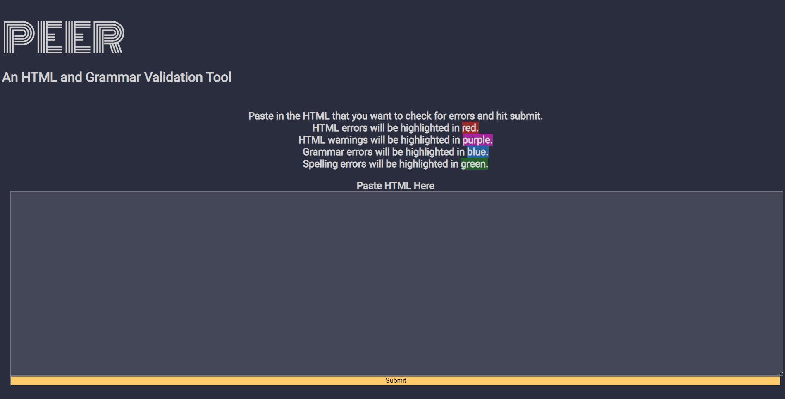
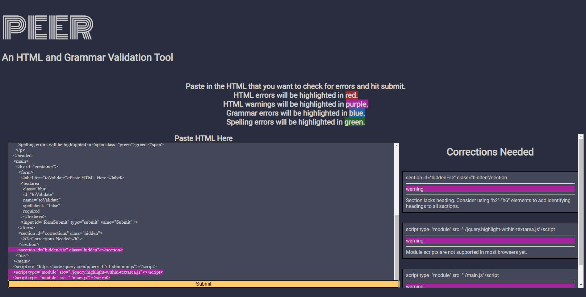

# PEER

## [Live App](https://calebgrove-git.github.io/PEER/)

An easy to use, all in one, grammar and HTML validator.

## Motivation

I wanted an app that could check grammar, spelling, and HTML so I didnt have to paste my code into more than one app.

## Summary

Users can paste their code directly into the text area and hit submit. The code will stay in the textbox and be highlighted by color to show grammar, spelling, HTML warnings, and errors. A list will be displayed at the bottom of the pages that has more info on the errors and possible fixes/suggestions.

## Screenshots

## Technologies

- HTML
- CSS
- JavaScript
- jQuery
